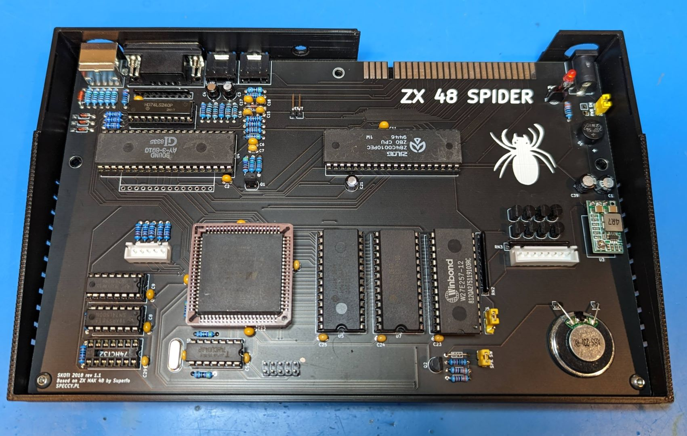
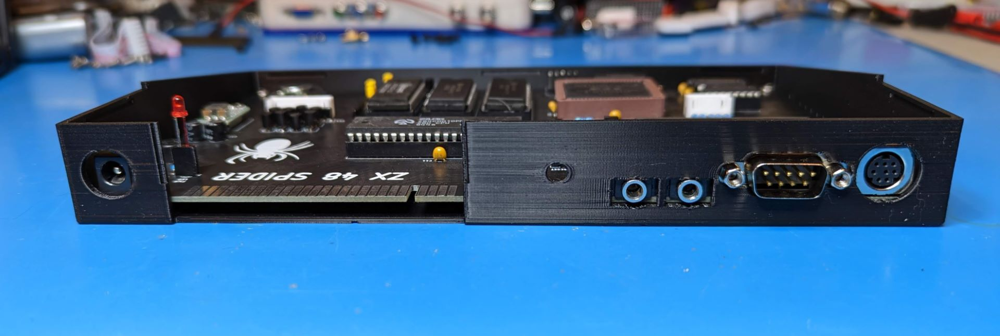
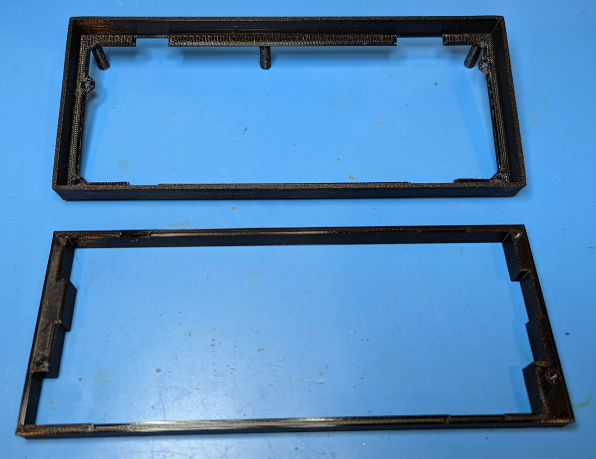
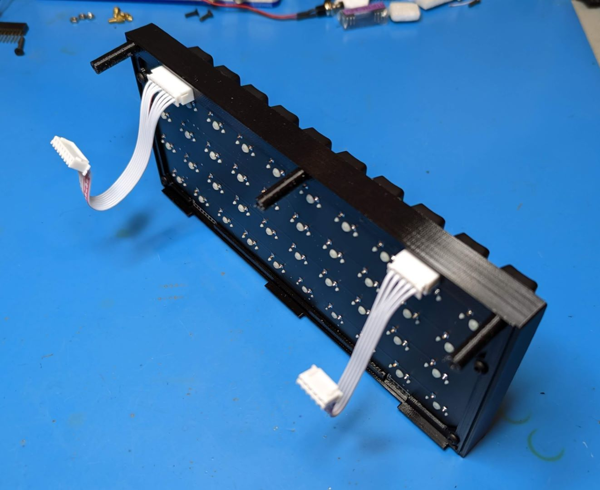
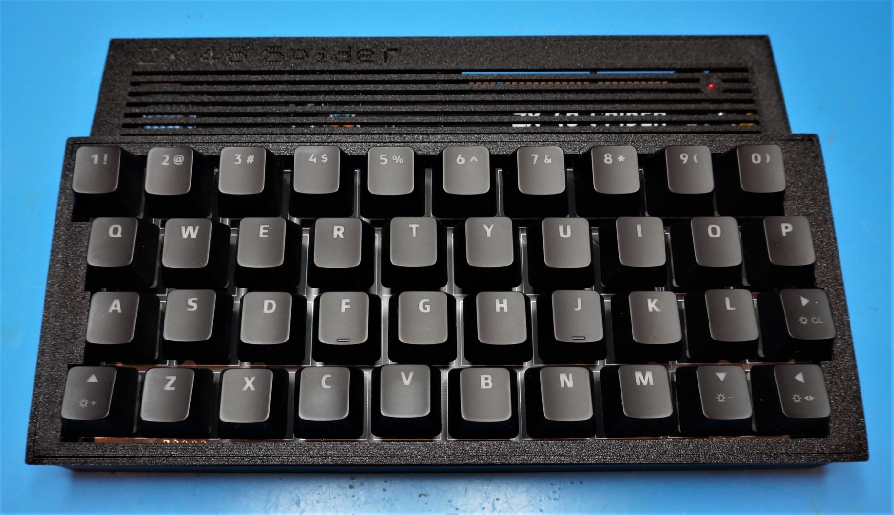
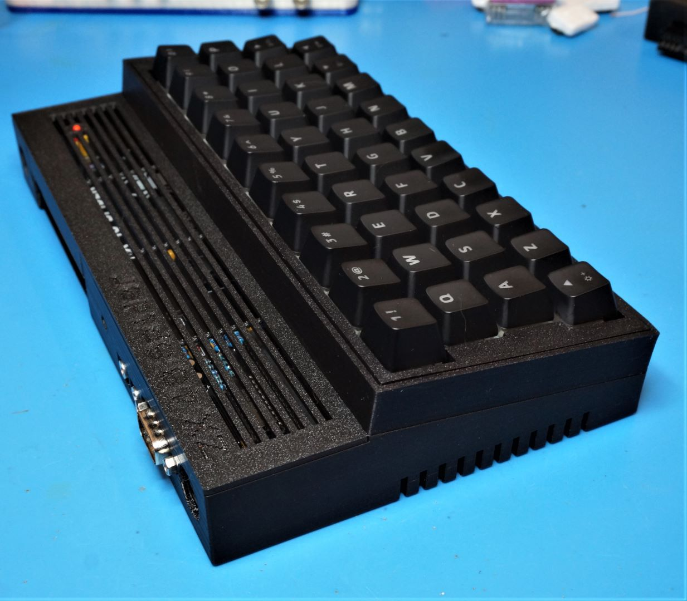
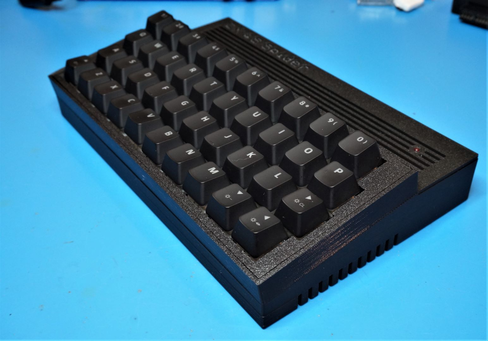
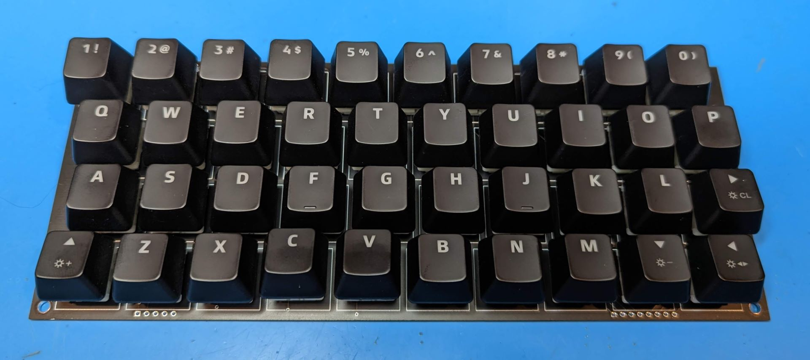

After starting to build a couple ZX Spectrum clone boards, I needed to find a case solution.  The reproduction 48K rubber keyboard cases are nice, but a bit rich for my blood and I had also built up a mechanical keyboard using Superfo's Cherry MX compatible PCB that I wanted to use. After seeing  [Lee Smith's Mechtrum on YouTube](https://www.youtube.com/watch?v=O_FdXpOi2W4) that used the same keyboard, I set out to design my own case with the following goals:

- Fits on a 220x220 Ender 3 class print bed in one piece
- Easy to print (minimal supports) and optimized for a 0.4mm nozzle and 2mm layer heights
- Minimal filament usage to print quickly and cheaply

Since then Lee has also made STL's of his design available to purchase to print your own for a small fee, so if you have a larger printer and don't mind using a bit more filament (~418 gram) for a slightly beefier design that is another good option now.

## The Design

The design is four parts and uses about 185 grams of filament (20% cubic infill) and measures 219 x 136mm at the base.  I've printed mine in PLA. Approximate print times (at 80mm/s, Two Trees SP-5 running Klipper) and filament usage are as follows:

| Component       | Time (Hours) | Filament Used (Grams) |
| --------------- | ------------ | --------------------- |
| Base            | 7.2          | 92                    |
| Cover           | 1.7          | 21                    |
| Keyboard Tray   | 3.6          | 46                    |
| Keyboard Insert | 1.9          | 26                    |

The base holds the PCB and it secured by two M3x4mm button head screws on the bottom. It is designed to sit on four 10mmx2mm rubber feet to elevate the board to the same height as a stock 48K case.  If you have a printer with great parts cooling you can print it without supports, but I print mine with supports on the rear holes to help make them a little cleaner. Each model has a slightly different base since the ports are different and I noticed not all PCB's have the mounting holes in the exact same location.

The cover is a snapfit design that secures with a M3x8mm taper head scew through the bottom of the case.  The cover is the same dimension across the different model, but has model specific text and in some cases features like a power LED. Print it face down without any supports.

The keyboard assembly is two pieces.  The tray should be be printed face down with supports. The insert also prints face down (screw holes facing up) and needs no supports. I experimented with printing both the tray and insert together and only using supports between them where the PCB normally goes, and while it worked and saves about 12g of filament and some printing time, removing the supports is a royal pain so I highly recommend you print them apart.

The keyboard PCB is bolted into the keyboard tray and secured by four M3x6mm button head screws to the keyboard insert.  I used 5p and 8p XH2.54 connectors and premade 100mm cables instead of the standard ZX keyboard connectors (TE 5-520315-8 and 5-520315-5) since they are cheap, easy to work with, and don't require an additional adapter or (expensive) 2.54mm solid core ribbon cable for direct insertion.

https://www.aliexpress.us/item/2251832555408405.html

https://www.aliexpress.us/item/2255801038163725.html

Once bolted together, the keyboard assembly snaps to the lower front of the case and is then secured with two M3x10mm taper head scews through the bottom of the case. The center support post rests on the PCB on models where there is room and helps to improve keyboard rigidity a bit.

If you're feeling extra thifty, or just like the look, you can also use the keyboard-tray-minimal option that doesn't have a bezel or insert, and instead bolts the keyboard to the tray from above with four M3x6 screws and nuts.  This one can be printed face down on the print bed without any supports.

## The Assembled Case

## The Keyboard

For all my boards I'm using this PCB that Superfo has shared on PCBWay.  He also has gerbers available for download there if you want to use a cheaper board house like JLCPCB. I would recommend fabbing it with black solder mask.

https://www.pcbway.com/project/shareproject/ZX_Spectrum_Keyboard.html

The board is designed to be used with 5 pin PCB mount Cherry MX style switches.  I used Gateron yellows.

https://www.aliexpress.us/item/3256802657968866.html

I also have some cheaper Outemu 3 pin plate mount switches on the way and once they arrive plan on working on a full keyboard tray insert similar to what Lee did with his design for future builds.

https://www.aliexpress.us/item/3256802192387196.html

Currently I just have some random keycaps from a spare keyboard on it, but on the future project list is creating some DIY dye sub PBT DSA profile keycaps using this method

https://www.youtube.com/watch?v=jNZkzK4l0F8

and the graphics file Doug Gabbard had put together for [WASD Keyboards](https://www.wasdkeyboards.com/) (you could also have some printed there for ~$50)

https://github.com/jdgabbard/ZX-Spectrum-MX-Keycaps

## Available Case Models

[ZX 48 Spider](zx-48-spider/README.md)

[Harlequin 48K Rev G](harlequin-48k-rev-g/README.md)

## The Design Process

Designing cases by measuring your model with something like some calipers is a pain.  Since most of the boards I was building didn't have full [KiCad](https://www.kicad.org/) or other EDA design files avilable, I had to take the gerbers files, pull them into KiCad GerberViewer and then export a new KiCad PCB file.  From there it was a simple matter of placing footprints and 3D models of key components on the PCB in KiCad and then exporting a STEP file.

My current 3D tool of choice is still [Design Spark Mechanical](https://www.rs-online.com/designspark/mechanical-software) (a free, cut down version of Ansys SpaceClaim).  Import the STEP file and then start modeling around it.  Once I had the intial design refined, it's simply a matter of swapping in new STEP files for a different board model, align in to the case walls, and then move the mounting holes and rear ports around as needed. 

I've included the KiCad projects, STEP files, and Designspark design files if anyone wants to modify or improve upon this work.

